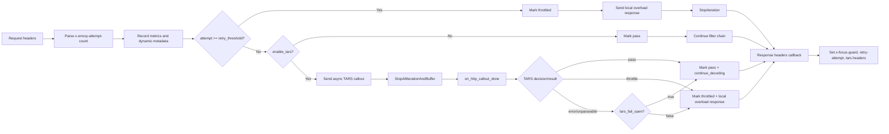
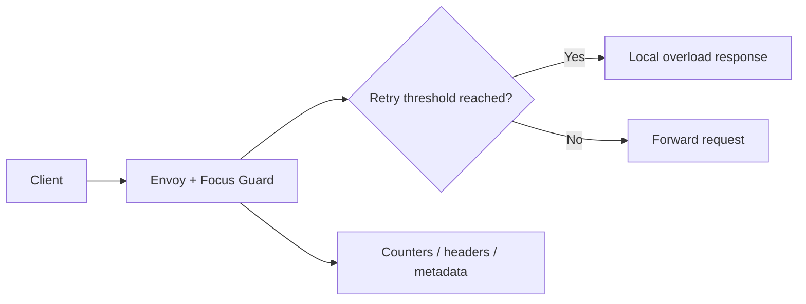

# Focus Guard
Focus Guard is a Rust dynamic module for Envoy that enforces deterministic retry guardrails before retry storms become operational and cognitive overload.

It is designed for high-pressure incident paths where teams need behavior that is predictable, inspectable, and easy to reason about.

## Quick Start
### 1) Prerequisites
- Rust toolchain (`rustc`, `cargo`)
- Built On Envoy CLI (`boe`)

### 2) Run Focus Guard locally
```bash
boe run --local . --config '{
  "retry_threshold": 3,
  "overload_status_code": 429,
  "overload_body": "Focus Guard: retry overload detected.",
  "enable_tars": false
}'
```

### 3) Validate pass/throttle behavior
```bash
curl -i -H "x-envoy-attempt-count: 1" http://localhost:10000/status/200
curl -i -H "x-envoy-attempt-count: 3" http://localhost:10000/status/200
```

### 4) Run tests
```bash
cargo test
```

### 5) Build the demo video
Use `STORYBOARD.md` for scene-by-scene visual documentation and YouTube-ready assembly instructions.

## Judge Checklist
> [!IMPORTANT]
> **Judge Checklist**
> - [x] Deterministic guardrails are enforced in-path (threshold-based pass/throttle)
> - [x] Callback safety is preserved (no blocking outbound model calls in HTTP stream callbacks)
> - [x] Observability is explicit (headers, dynamic metadata, counters, histogram)
> - [x] Behavior is reproducible with simple CLI commands
> - [x] Validation is covered by unit tests across config parsing and decision paths
> - [x] Demo workflow is documented for submission via `STORYBOARD.md`
## Submission overview
> [!IMPORTANT]
> **Submission Checklist**
> - [x] Clear incident-response problem statement
> - [x] Deterministic proxy-layer approach
> - [x] Distinct technical contribution and safety boundary
> - [x] Practical impact on operator clarity and focus
### Problem
Incident response often degrades into noisy retry loops. That noise increases ambiguity, fragments operator attention, and slows debugging.
### Approach
Focus Guard applies deterministic threshold-based retry controls first, then (optionally) invokes asynchronous TARS AI callouts for below-threshold traffic to produce explicit pass/throttle outcomes with strong observability signals.
### Why this project is distinct
- Reframes resilience controls around cognitive clarity as well as service reliability.
- Implements the control in-path as a native Envoy Rust dynamic module.
- Prioritizes deterministic behavior first; optional AI is intentionally gated behind callback-safe boundaries.
### Practical impact
Focus Guard converts noisy retry churn into explicit, debuggable states (`pass` vs `throttled`), helping teams maintain focus while preserving predictable runtime behavior.
## What Focus Guard does
At request-header time, the filter:
1. Reads `x-envoy-attempt-count` (defaults to `1` if missing or invalid).
2. Records telemetry (`focus_guard.requests_total`, retry histogram).
3. Applies deterministic throttling if `attempt >= retry_threshold`.
4. If below threshold and `enable_tars=true`, sends an asynchronous TARS callout and buffers request progression.
5. Continues decoding on TARS `pass`, or sends a local overload response on TARS `throttle`.
6. Falls back to fail-open/fail-closed behavior when TARS callout initialization or response parsing fails.

At response-header time, it emits deterministic decision headers:
- `x-focus-guard`: `pass` or `throttled`
- `x-focus-guard-retry-attempt`: parsed attempt count
- `x-focus-guard-tars`: `disabled` or `active`
## Architecture
### Components
- `RawFilterConfig`: JSON-deserializable user config.
- `FilterConfigImpl`: validated runtime config and metric handles.
- `FilterConfig`: global config factory and metric definition point.
- `PerRouteFilterConfig`: optional per-route behavior overrides.
- `Filter`: per-stream state (`last_retry_attempt`, `throttled`, `pending_tars_callout_id`) and async callout result handling via `on_http_callout_done`.
### Request/response flow

### Callback-safety and AI boundary
`enable_tars` is callback-safe and non-blocking:
- Uses Envoy async HTTP callouts from the stream filter context.
- Returns `StopAllIterationAndBuffer` while waiting on TARS, then resumes with `continue_decoding()` when appropriate.
- Applies explicit fail-open or fail-closed fallback when callouts fail or responses are unparseable.
- Never performs direct blocking network calls inside stream callbacks.
## Configuration
Focus Guard accepts JSON config through the dynamic-module filter config.

Supported fields:
- `retry_threshold` (default `3`, minimum enforced `1`)
- `overload_status_code` (default `429`, validated to `100..=599`, fallback `429`)
- `overload_body` (default `"Focus Guard throttled request due to retry overload."`)
- `enable_tars` (default `false`; enables async TARS decision callouts)
- `tars_cluster` (default `\"api.router.tetrate.ai:443\"`)
- `tars_authority` (default `\"api.router.tetrate.ai\"`)
- `tars_path` (default `\"/v1/chat/completions\"`)
- `tars_model` (default `\"o3-mini\"`)
- `tars_timeout_milliseconds` (default `250`)
- `tars_fail_open` (default `true`)
- `tars_api_key` (optional bearer token)

Example:
```json
{
  "retry_threshold": 3,
  "overload_status_code": 429,
  "overload_body": "Focus Guard: please pause and retry later.",
  "enable_tars": false
}
```
## Observability
### Metrics
Config-scoped metrics (defined when available):
- `focus_guard.requests_total` (counter)
- `focus_guard.throttled_total` (counter)
- `focus_guard.retry_attempt` (histogram)
### Dynamic metadata
Namespace: `focus_guard`
- `retry_attempt` (number)
- `throttled` (bool)
### Headers
- Request header set by filter: `x-focus-guard`
- Local response headers on throttle:
  - `x-focus-guard: throttled`
  - `x-focus-guard-tars: disabled|active`
  - `content-type: text/plain; charset=utf-8`
- Response headers:
  - `x-focus-guard`
  - `x-focus-guard-retry-attempt`
  - `x-focus-guard-tars`
## Local development
### Prerequisites
- Rust toolchain (`rustc`, `cargo`)
- Built On Envoy CLI (`boe`)
### Run tests
```bash
cargo test
```
### Run locally
```bash
boe run --local .
```

Then exercise the route:
```bash
curl -v http://localhost:10000/status/200
```
### Run with explicit config
```bash
boe run --local . --config '{
  "retry_threshold": 3,
  "overload_status_code": 429,
  "overload_body": "Focus Guard: retry overload detected.",
  "enable_tars": false
}'
```
## Storyboard (YouTube-ready demo documentation)
Use `STORYBOARD.md` for a scene-by-scene production plan, including visuals, voiceover script, command captures, and a fast assembly workflow for YouTube upload.

Command sequence used in the storyboard:
```bash
boe run --local . --config '{
  "retry_threshold": 3,
  "overload_status_code": 429,
  "overload_body": "Focus Guard: retry overload detected.",
  "enable_tars": false
}'
curl -i -H "x-envoy-attempt-count: 1" http://localhost:10000/status/200
curl -i -H "x-envoy-attempt-count: 3" http://localhost:10000/status/200
cargo test
```
## Validation coverage
> [!IMPORTANT]
> **Validation Checklist**
> - [x] Config parsing and defaults are tested
> - [x] Invalid/fallback config paths are tested
> - [x] Deterministic pass/throttle decisions are tested
> - [x] Response signaling headers are tested
Unit tests currently cover:
- config defaults and custom parsing
- invalid config fallback behavior
- per-route config parsing failure cases
- deterministic pass/throttle request-header behavior
- async TARS callout start and completion behavior
- TARS decision parsing and response-header signaling behavior
## Project status
The current scope provides deterministic safety by default and optional AI-assisted throttling through callback-safe asynchronous TARS callouts.
## License
Apache-2.0


## Solution
A Rust Envoy dynamic module that applies deterministic retry throttling and observable pass/throttle behavior.

## Architecture Diagram


## Tech Stack
- Rust
- Envoy dynamic module
- Built On Envoy CLI
- Observability instrumentation

## Setup Instructions
```bash
cargo test
boe run --local .
```

## Testing
- cargo test
- curl request simulations with x-envoy-attempt-count header

## ANZSCO 261312 Competency Evidence
- Systems programming for reliability controls.
- Operational tooling with deterministic behavior under load.
- Testing and observability for incident response workflows.

## Commit Convention
Use Conventional Commits for presentation clarity:
- `feat(scope): add new user-facing capability`
- `fix(scope): resolve functional defect`
- `test(scope): add or improve automated tests`
- `docs(readme): improve project documentation`

## Evidence Map
- `src/`
- `STORYBOARD.md`
- `Cargo.toml`
